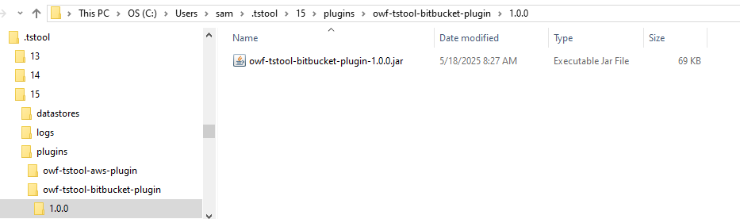

# TSTool / Install Bitbucket Plugin #

This appendix describes how to install and configure the TSTool Bitbucket Plugin.

*   [Install TSTool](#install-tstool)
*   [Install and Configure the TSTool Bitbucket Web Services Plugin](#install-and-configure-the-tstool-bitbucket-web-services-plugin)

-------

## Install TSTool ##

TSTool must be installed before installing the Bitbucket plugin.
Typically the latest stable release should be used, although a development version can be installed
in order to use new features.
Multiple versions of TSTool can be installed at the same time.

1.  Download TSTool:
    *   Download the Windows version from the
        [State of Colorado's TSTool Software Downloads](https://opencdss.state.co.us/tstool/) page.
    *   Download the Linux version from the
        [Open Water Foundation TSTool download page](https://software.openwaterfoundation.org/tstool/).
2.  Run the installer and accept defaults.
3.  Run TSTool once by using the ***Start / CDSS / TSTool-Version*** menu on Windows
    (or run the `tstool` program on Linux).
    This will automatically create folders needed to install the plugin.

## Install and Configure the TSTool Bitbucket Web Services Plugin ##

This documentation describes how to install and configure the TSTool Bitbucket plugin.

The folder structure on the computer should be similar to the following.
TSTool version 15.0.0 introduced the convention of using a version folder,
which allows multiple versions of plugins to be installed.

```
Windows:

       C:\Users\user\.tstool\15\
         plugins\
           owf-tstool-bitbucket-plugin\
             1.0.0\
               owf-tstool-bitbucket-plugin-1.0.0.jar

Linux:

       /home/user/.tstool/15/
         plugins/
           1.0.0/
             owf-tstool-bitbucket-plugin-1.0.0.jar
```

On Windows, the installation folder in Windows Explorer will be similar to the following:

**<p style="text-align: center;">

</p>**

**<p style="text-align: center;">
Bitbucket Plugins Folders on Windows (<a href="../windows-plugins.png">see full-size image)</a>
</p>**

To install or update the plugin:

1.  Download the `tstool-bitbucket-plugin` software installer file from the
    [TSTool Bitbucket Download page](https://software.openwaterfoundation.org/tstool-bitbucket-plugin/).
    For example with a name similar to `tstool-bitbucket-plugin-1.0.0-win-202505182329.zip`.
2.  If installing the plugin in user files and if TSTool was not run before,
    run TSTool once to automatically create user folders and files needed by the plugin.
3.  Expand the zip file or navigate to the zip file in Windows Explorer.
    Copy the top-level folder in the zip file to the TSTool `plugins` folder
    as shown in the above folder structure.
4.  Configure one or more datastore configuration files according to the
    [Bitbucket Data Web Services Datastore](../datastore-ref/Bitbucket/Bitbucket.md#datastore-configuration-file) documentation.
5.  Test web services access by reading repository data using the
    [`Bitbucket`](../command-ref/Bitbucket/Bitbucket.md) command.
6.  If there are issues, use the ***View / Datastores*** menu item to list enabled datastores.
7.  Use the ***Tools / Plugin Manager*** to view plugin information,
    which will show which version of the plugin is loaded for the TSTool version.
8.  If necessary, see the [Troubleshooting](../troubleshooting/troubleshooting.md) documentation.
