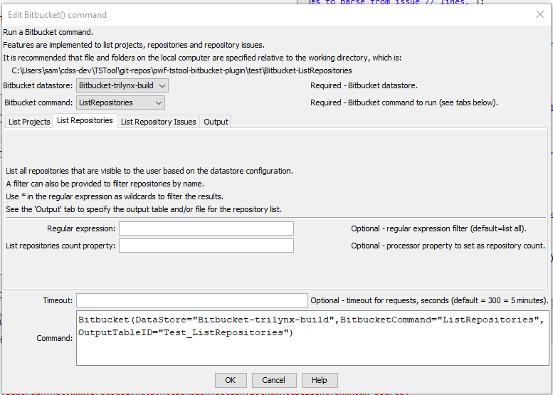

# TSTool / Command / Bitbucket #

*   [Overview](#overview)
*   [Command Editor](#command-editor)
    +   [List Projects](#list-projects)
    +   [List Repositories](#list-repositories)
    +   [List Repository Issues](#list-repository-issues)
*   [Command Syntax](#command-syntax)
*   [Examples](#examples)
*   [Troubleshooting](#troubleshooting)
*   [See Also](#see-also)

-------------------------

## Overview ##

The `Bitbucket` command reads project, repository, and repository issues data from Bitbucket web services and outputs tables,
which can be used in automated workflows.

See the [Bitbucket Data Web Services Appendix](../../datastore-ref/Bitbucket/Bitbucket.md)
for more information about Bitbucket web service integration and limitations.

## Command Editor ##

The following dialog is used to edit the command and illustrates the syntax for the command.
The top and bottom of the editor provides general command parameters.
Tabs are provided for each Bitbucket command.

### List Projects ###

The following dialog is used to edit the ***List Projects*** command and illustrates the command syntax.

**<p style="text-align: center;">

</p>**

**<p style="text-align: center;">
`Bitbucket` Command Editor to List Projects (<a href="../Bitbucket-ListProjects.png">see full-size image)</a>
</p>**

The ***Output*** tab is used to specify the output table for results.

**<p style="text-align: center;">

</p>**

**<p style="text-align: center;">
`Bitbucket` Command Editor for Output Parameters (<a href="../Bitbucket-Output.png">see full-size image)</a>
</p>**

### List Repositories ###

The following dialog is used to edit the ***List Repositories*** command and illustrates the command syntax.

**<p style="text-align: center;">

</p>**

**<p style="text-align: center;">
`Bitbucket` Command Editor to List Repositories (<a href="../Bitbucket-ListRepositories.png">see full-size image)</a>
</p>**

### List Repository Issues ###

The following dialog is used to edit the ***List Repository Issues*** command and illustrates the command syntax.

**<p style="text-align: center;">

</p>**

**<p style="text-align: center;">
`Bitbucket` Command Editor to List Repository Issues (<a href="../Bitbucket-ListRepositoryIssues.png">see full-size image)</a>
</p>**

## Command Syntax ##

The command syntax is as follows. The `BitbucketCommand` indicates which tab's parameters will be used.

```text
Bitbucket(Parameter="Value",...)
```

**<p style="text-align: center;">
Command Parameters
</p>**

|**Area/Tab**|**Parameter**&nbsp;&nbsp;&nbsp;&nbsp;&nbsp;&nbsp;&nbsp;&nbsp;&nbsp;&nbsp;&nbsp;&nbsp;&nbsp;&nbsp;&nbsp;&nbsp;&nbsp;&nbsp;&nbsp;&nbsp;&nbsp;&nbsp;&nbsp;&nbsp;&nbsp;&nbsp;|**Description**|**Default**&nbsp;&nbsp;&nbsp;&nbsp;&nbsp;&nbsp;&nbsp;&nbsp;&nbsp;&nbsp;&nbsp;&nbsp;&nbsp;&nbsp;&nbsp;&nbsp;&nbsp;&nbsp;&nbsp;&nbsp;&nbsp;&nbsp;&nbsp;&nbsp;&nbsp;&nbsp;&nbsp;|
|--------------|-----------------|-----------------|--|
|Top|`DataStore`<br>**required**|The Bitbucket datastore name to use for the web services connection, as per datastore configuration files (see the [Bitbucket Web Services Datastore appendix](../../datastore-ref/Bitbucket/Bitbucket.md)). | None - must be specified. |
| | `BitbucketCommand`<br>**required**| The Bitbucket command to run. | None - must be specified. |
|***List Projects***|`ListProjectsRegEx`| A regular expression to match Bitbucket projects, using `*` for wildcards. | Match all projects. |
| |`ListProjectsCount`<br>`Property`|The property name for the project count. | |
|***List Repositories***|`ListRepositoriesRegEx`| A regular expression to match Bitbucket repositories, using `*` for wildcards. | Match all repositories. |
| |`ListRepositoriesCount`<br>`Property`|The property name for the repository count. | |
|***List Repository Issues***|`Assignee`| A single assignee to match, using the user's display name. | Match all repository issues. |
| |`IncludeOpenIssues`| Whether to include open issues, `True` or `False`. | `True` |
| |`IncludeClosedIssues`| Whether to include closed issues, `True` or `False`. | `False` |
| |`IssueProperties`| Names of properties to extract from the issue description, as property names separated by commas.  The properties should be specified in the description using format `// Property1=Value1 Property2=Value2`. | `False` |
| |`ListRepositoryIssuesRegEx`| A regular expression to match Bitbucket repository issue titles, using `*` for wildcards. | Match all repository issues. |
| |`ListRepositoriesCount`<br>`Property`|The property name for the repository issue count. | |
|***Output***|`OutputTableID`| The table identifier for the output list.|  |
| |`OutputFile`| The path to the output comma-separated-value file. | |
| |`AppendOutput`| Whether to append output to the table or file. | Create, but do not append. |
| ***Bottom*** |`Timeout`| The timeout in seconds, used to prevent nonresponsive web services from hanging TSTool. | `300` |

## Examples ##

See the [automated tests](https://github.com/OpenWaterFoundation/owf-tstool-bitbucket-plugin/tree/master/test/commands/Bitbucket).

## Troubleshooting ##

If retrieving data has errors, try the following:

1.  Review the TSTool log file (see ***Tools / Diagnostics - View Log File*** for current and startup log file.)
2.  Confirm that the authorization information in the datastore configuration file is correct.
3.  Use command line `curl` to query the URL shown in the log file.

## See Also ##

*   [`WebGet`](https://opencdss.state.co.us/tstool/latest/doc-user/command-ref/WebGet/WebGet/) command
