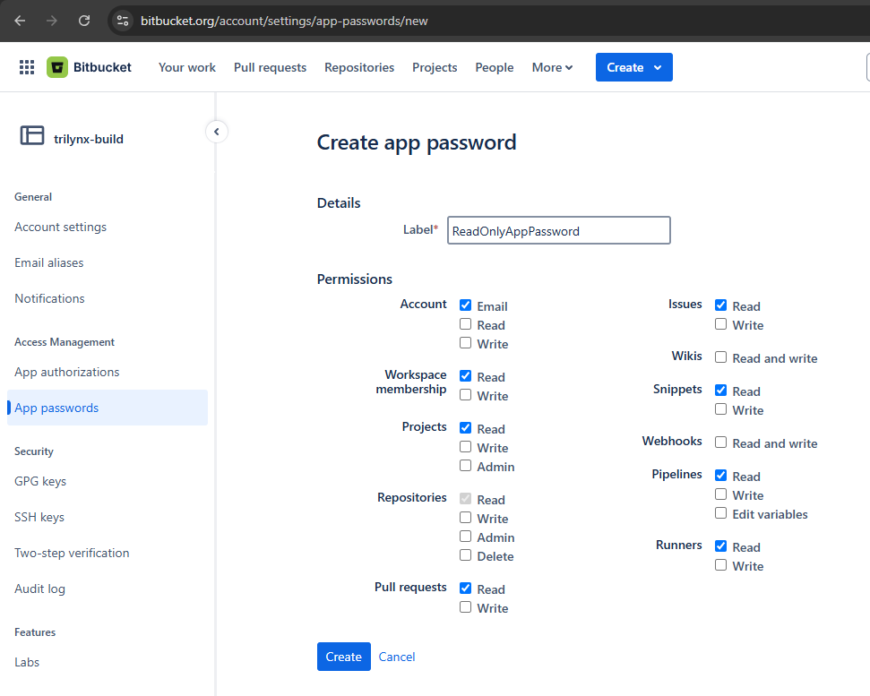

# TSTool / Datastore Reference / Bitbucket Web Services #

*   [Overview](#overview)
*   [Limitations](#limitations)
*   [Datastore Configuration File](#datastore-configuration-file)
*   [Generating an App Password](#generating-an-app-password)
*   [See Also](#see-also)

--------------------

## Overview ##

The Bitbucket Cloud web services allow respository data data to be queried by software,
including web applications and analysis tools such as TSTool.
TSTool accesses Bitbucket web services using the Bitbucket plugin.
See the following documentation:

*   [Install Bitbucket Plugin appendix](../../appendix-install/install.md)
*   [`Bitbucket` command](../../command-ref/Bitbucket/Bitbucket.md)
*   [Bitbucket Cloud API documentation](https://developer.atlassian.com/cloud/bitbucket/rest/)

The TSTool plugin lists project, repository, and repository list ata,
which are then processed into tables.

## Limitations ##

The plugin currently only reads project, repository, and repository issue data and outputs tables.
Additional functionality may be added in the future.

## Datastore Configuration File ##

A datastore is configured by creating a datastore configuration file.

Create a user datastore configuration file `.tstool/NN/datastores/Bitbucket-somename.cfg` (or similar) in the user's files,
for example by copying and modifying the following example or copying from another installation.
The `NN` should agree with the major TSTool version, for example `14` as shown by the ***Help / About TSTool*** menu.
TSTool will attempt to open datastores for all enabled configuration files.

The following illustrates the Bitbucket datastore configuration file format
and configures a datastore named `Bitbucket-someaccount`.
The `Name` property is the datastore name that will be used by the TSTool - the file name can be any name
but is often the same as the `Name` with extension `.cfg`.

```
# Configuration information for Bitbucket web service datastore.
# Properties are:
#
# Enabled - indicates if the datastore is enabled (active)
# ServiceApiDocumentationURL - URL for online API documentation
# Type - must be BitbucketDataStore to find proper software
#
# The user will see the following when interacting with the data store:
#
# Name - data store identifier used in applications, for example as the
#     input type information for time series identifiers (usually a short string)
# Description - data store description for reports and user interfaces (short phrase)
# ServiceRootURL - web service root URL, including the server name and root path

Enabled = True
Type = "BitbucketDataStore"
Name = "Bitbucket-someaccount"
Description = "Bitbucket service account datastore"
ServiceRootURL = "https://api.bitbucket.org/2.0/"
ServiceApiDocumentationURL = "https://developer.atlassian.com/cloud/bitbucket/rest/"
# Authentication information.
UserName = "someuser"
WorkspaceID = "workspaceid"
AppPassword = "the-app-password"
# Turn on debug if necessary for troubleshooting.
#Debug = true
```

**<p style="text-align: center;">
Bitbucket Web Services DataStore Configuration File
</p>**

The following table describes configuration file properties.
See the [Generating an App Password](#generating-an-app-password) section
for information about generating a Bitbucket App password.

**<p style="text-align: center;">
Bitbucket Web Services DataStore Configuration File Properties
</p>**

| **Property**&nbsp;&nbsp;&nbsp;&nbsp;&nbsp;&nbsp;&nbsp;&nbsp;&nbsp;&nbsp;&nbsp;&nbsp;&nbsp;&nbsp;&nbsp;&nbsp;&nbsp;&nbsp;&nbsp;&nbsp;&nbsp;&nbsp;&nbsp;&nbsp;&nbsp;&nbsp;&nbsp;&nbsp;&nbsp;&nbsp;&nbsp;&nbsp;&nbsp;&nbsp;&nbsp;&nbsp;&nbsp;&nbsp;&nbsp;&nbsp; | **Description** | **Default** |
| -- | -- | -- |
| `AppPassword` | The Bitbucket App Password to authenticate the connection.  See the [Generating an App Password](#generating-an-app-password) section.  It is recommended that an App Password with read-only permissions is used. |
| `Debug` | Turn on additional logging messages, for example to troubleshoot integration with the API. |
| `Description`<br>**required** | Description of the datastore, typically a short sentence, used in some displays. | None - must be specified. |
| `Enabled` | Indicates whether the datastore is enabled. | `True` |
| `Name`<br>**required** | Datastore name that is used in the TSTool software and Bitbucket plugin commands.  The name should be unique across all datastores. | None - must be specified. |
| `ServiceApiDocumentationURL` | The URL for the web services API documentation.  This is used by software to display documentation. | Documentation will not be available from command editors. |
| `ServiceRootURL`<br>**required** | The root URL for the web services.  This should include everything except the service name and query parameters (the specific service name and query parameters are automatically specified by software to query data). | None - must be specified. |
| `Type`<br>**required** | Must be `BitbucketDataStore`, which is used by TSTool to identify which plugin software to use for the datastore. | None - must be specified. |
| `UserName`<br>**required** | The Bitbucket account user name. | None - must be specified. |
| `WorkspaceID`<br>**required** | The workspace identifier. | None - must be specified. |

## Generating an App Password ##

The configuration file `WorkspaceID`, `UserName`, and `AppPassword` properties must be specified in the datastore configuration file
to enable access to the Bitbucket API, as follows:

*   `WorkspaceID` is assigned for the organization's account.
    Use the ***Settings*** (gear) icon in the upper right of the Bitbucket page,
    and then ***Workspace settings***, which will display the Workspace ID.
*   `UserName` is the user's Bitbucket account user name.
*   An `AppPassword` is created as follows: 
    1.  Use the ***Settings*** (gear icon) in the upper right of the Bitbucket page,
        and then ***Personal Bitbucket settings***.
    2.  Click on the ***App passwords*** link as shown in the following figure.
    3.  Enter appropriate permissions and assign a name to the password.
        It is recommended to lock down the permissions as much as possible for the application.
        Press ***Create*** to create the app password.
        The password will be shown and should be saved in a secure location in case the configuration file is deleted.

        **<p style="text-align: center;">
        
        </p>**

        **<p style="text-align: center;">
        Generating an App Password (<a href="../app-password.png">see full-size image)</a>
        </p>**

## See Also ##

*   [`Bitbucket`](../../command-ref/Bitbucket/Bitbucket.md) command
